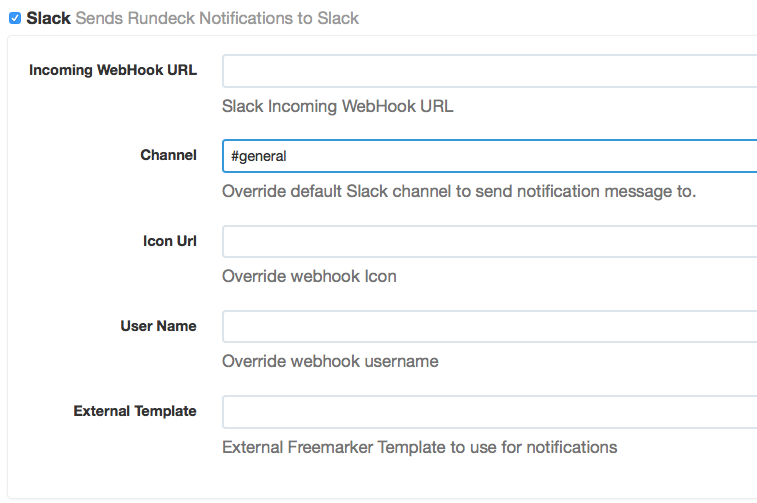

rundeck-slack-plugin
======================

Sends rundeck notification messages to a slack channel. This plugin 
is based on HipChat Plugin from Hayden Bakkum

Installation Instructions
-------------------------

1. Get the project (download zip, or git clone)

    git@github.com:bitplaces/rundeck-slack-plugin.git

1. build the source

    cd rundeck-slack-plugin;
    
    ./gradlew

3. result file is in the

    ./build/libs/rundeck-slack-plugin-1.8.jar

4. Copy the plugin jar (rundeck-slack-plugin-\<version\>.jar) into your $RDECK_BASE/libext - no restart of rundeck required. 

See the [rundeck documentation](http://rundeck.org/docs/manual/plugins.html#installing-plugins) for more 
information on installing rundeck plugins.

## Configuration
This plugin uses Slack webhooks. Create a new webhook and copy the provided token.



The only required configuration settings are:

- `API Auth Token`: webhook token
- `Team Domain`: the `mycompany` part of `https://mycompany.slack.com`

Additionally you can set:

- `Icon Url`: location to pull the avatar icon (otherwise an emoji of `:rundeck:` will be used)
- `User Name`: the username the message should come from (default: `RunDeck`)

### External Templates
The HipChat plugin this was based off used FreeMarker templates for building the JSON to post to Slack. The challenge is when you wanted to change the layout of a message.
Since the FreeMarker template was compiled in that meant recompiling the plugin for every change to the template.
Additionally it meant you could not customize the template based on job status.

The setting `External Template` allows you to define a FreeMarker template that you want to use for the formatting of the Slack message. This is PER trigger so you can use a different template for start, failure and success and do so for each job.

To use this, you'll need to create a directory in `/var/lib/rundeck/libext/templates` (This will be made customizable at some point). In that directory you can place FreeMarker templates for the JSON you want to post to Slack. The value for this setting is the name of the file (without the path).

All the job context is passed in as a map named `externalData`.

In the following screenshot, you can see and example of this:


The start message was posted using the baked in template (the default).
The success message, however, was formatted using the following custom template:

```
{
  "text": "<${executionData.href}|Execution #${executionData.id}> of job <${executionData.job.href}|${executionData.job.name}> has <#if trigger == "start">started<#elseif trigger == "failure">failed<#elseif trigger == "success">succeeded</#if>",
  "color": "${color}",
  "channel":"${channel}",
<#if (username)?has_content>
  "username": "${username}",
<#else>
  "username": "RunDeck",
</#if>
<#if (icon_url)?has_content>
  "icon_url": "${icon_url}"
<#else>
  "icon_emoji": ":rundeck:"
</#if>
}
```

This can give you much more compact messages should you want that.

### Slack icon

You have three possibilties to enable slack icons for incoming web-hooks:

1.  define a icon-url in RunDeck job configuration
2.  set a custom emoji in slack for `:rundeck:`, see [here](https://slack.com/emoji), leave the icon-url empty
3.  set default icon for Incoming WebHooks

## Contributors
*  Original author: Hayden Bakkum @hbakkum
*  @totallyunknown
*  @notandy
*  @lusis
